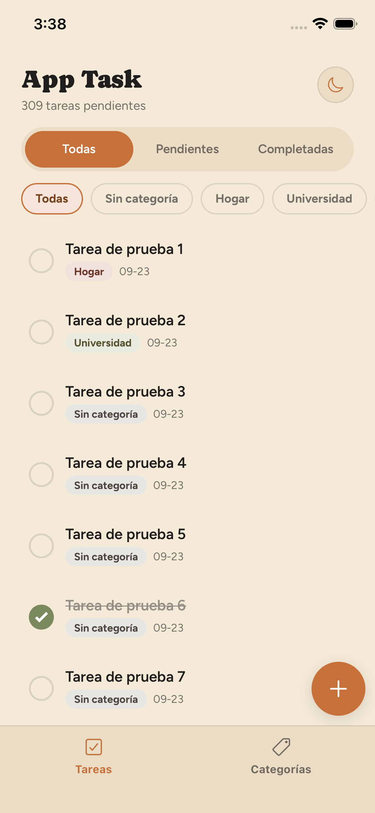
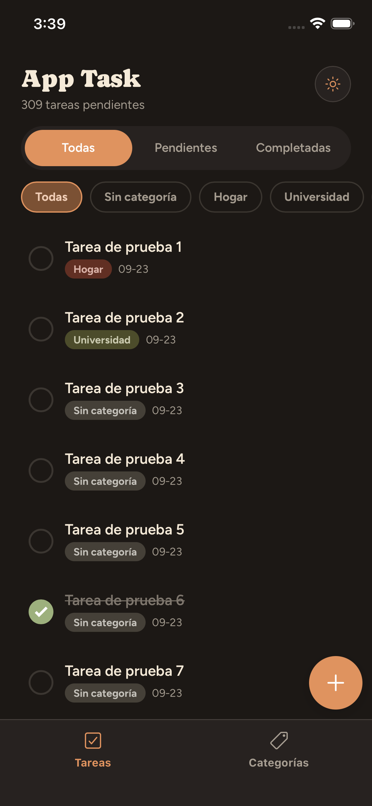
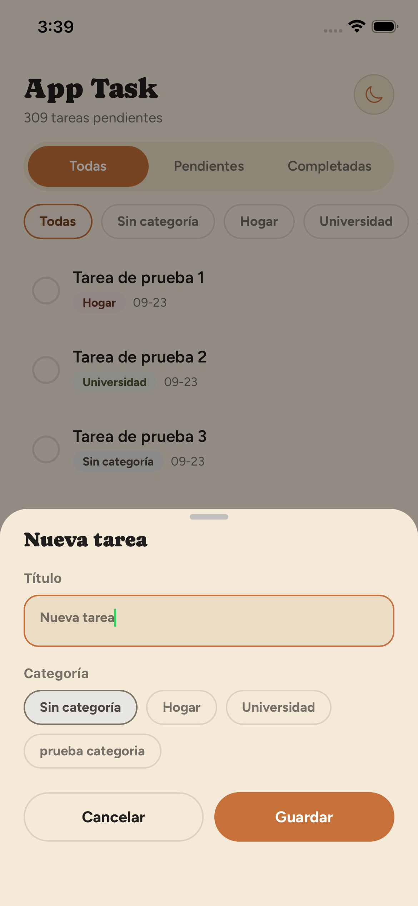
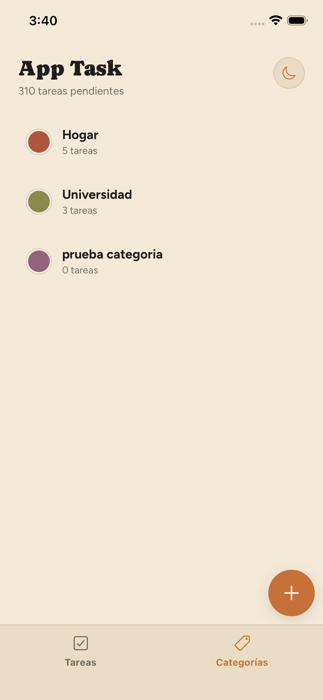
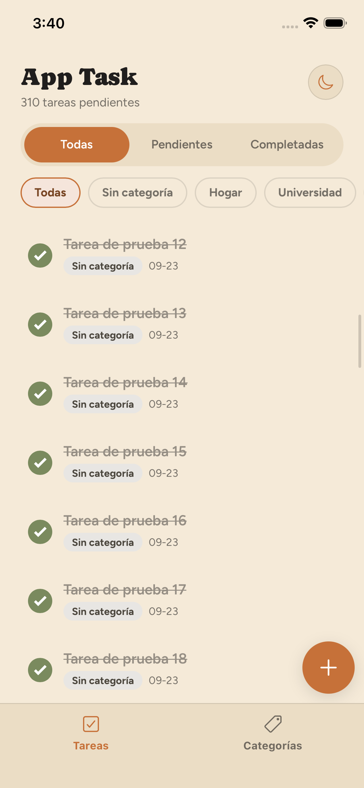
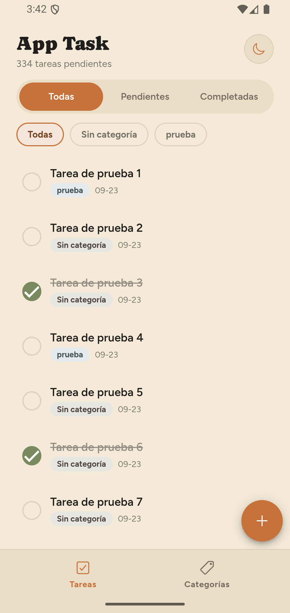
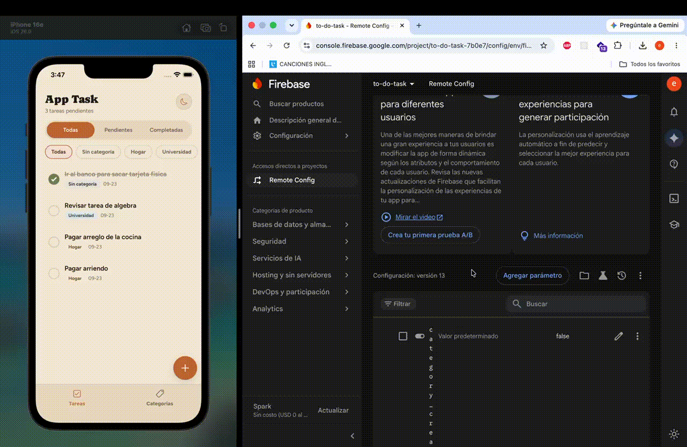

# App Task — To-Do List con categorías

Aplicación móvil híbrida para gestionar tareas organizadas por categorías, construida con **Ionic + Angular + Capacitor**, persistencia local en **SQLite** y feature flags controlados desde **Firebase Remote Config**.

Desarrollada como prueba técnica para el cargo de Desarrollador Mobile Ionic. Este documento explica cómo ejecutar la aplicación, las decisiones técnicas tomadas y los cambios realizados.

---

## Tabla de contenido

1. [Demo](#demo)
2. [Funcionalidades](#funcionalidades)
3. [Stack tecnológico](#stack-tecnológico)
4. [Decisiones técnicas](#decisiones-técnicas)
5. [Modelo de datos](#modelo-de-datos)
6. [Firebase Remote Config](#firebase-remote-config)
7. [Optimización de rendimiento](#optimización-de-rendimiento)
8. [Instalación y ejecución](#instalación-y-ejecución)
9. [Pruebas y calidad](#pruebas-y-calidad)
10. [Estructura del proyecto](#estructura-del-proyecto)

---

## Demo

<!-- TODO: tomar las capturas y guardarlas en docs/screenshots/ con estos nombres. -->

| Tareas (claro) | Tareas (oscuro) | Nueva tarea | Categorías |
| :---: | :---: | :---: | :---: |
|  |  |  |  |

| iOS | Android |
| :---: | :---: |
|  |  |

**Feature flags en tiempo real** (cambio en la consola de Firebase reflejado en la app sin reiniciar):

<!-- TODO: agregar el video o GIF de la demo del feature flag. -->


**Descargas:**

<!-- TODO: agregar los enlaces de descarga del APK y el IPA (GitHub Releases) al generar los ejecutables. -->
- APK (Android): _pendiente_
- IPA (iOS): _pendiente_

---

## Funcionalidades

### Tareas
- Listar tareas con indicador visual de completada y pendiente.
- Crear tarea con título y categoría opcional.
- Editar tarea (tocando la tarjeta o deslizando hacia la izquierda).
- Marcar y desmarcar como completada.
- Eliminar con confirmación (`ion-alert`).
- Filtrar por estado (Todas / Pendientes / Completadas) y por categoría, incluido **"Sin categoría"**.

### Categorías
- Listar categorías con la cantidad de tareas de cada una.
- Crear y editar categorías con nombre y color de una paleta.
- Eliminar categoría sin afectar sus tareas.

### Experiencia de usuario
- Skeleton durante la primera carga y estados vacíos con acción directa.
- Toasts de confirmación tras cada acción y **toasts de error** si algo falla.
- Formularios como *bottom sheets* (modal desde abajo) en lugar de pantallas completas.
- Contador de tareas pendientes en el encabezado.

### Mejoras adicionales

Funcionalidades que no pedía la prueba y se agregaron para mejorar la experiencia:

- **Modo claro / oscuro**: sigue el tema del sistema en vivo y se puede alternar manualmente desde el encabezado.
- **Crear una categoría sin salir de la tarea** (activable por Remote Config): el selector de categoría muestra un chip "+ Nueva" que abre el formulario de categoría encima y deja la nueva categoría seleccionada.
- **Pendientes primero** (activable por Remote Config): las tareas completadas pasan al final de la lista.

---

## Stack tecnológico

| Tecnología | Versión | Uso |
| --- | --- | --- |
| [Ionic](https://ionicframework.com/) | 9 | Componentes de UI nativos y theming |
| [Angular](https://angular.dev/) | 22 | Framework: standalone components, signals, **zoneless** |
| [Capacitor](https://capacitorjs.com/) | 8 | Motor híbrido para compilar a iOS y Android |
| [@capacitor-community/sqlite](https://github.com/capacitor-community/sqlite) | 8 | Base de datos local SQLite |
| [@capacitor-firebase/remote-config](https://github.com/capawesome-team/capacitor-firebase) | 8 | Feature flags con Firebase Remote Config |
| TypeScript | 6 | Modo estricto |
| Vitest | 4 | Pruebas unitarias (`ng test`) |

No se usan librerías de UI de terceros: toda la interfaz está construida con componentes de Ionic y variables CSS.

---

## Decisiones técnicas

### Capacitor en lugar de Cordova

La prueba menciona Cordova como motor para compilar a Android e iOS. Se eligió **Capacitor** de forma deliberada:

- Es el **sucesor oficial** de Cordova, creado y mantenido por el mismo equipo de Ionic, y es la opción que Ionic recomienda para proyectos nuevos ya que cordova se encuentra deprecado actualmente.
- Los proyectos nativos (`ios/` y `android/`) son proyectos reales de Xcode y Android Studio que se versionan con el código, en lugar de generarse en cada build.
- Los plugins usan APIs nativas modernas (Swift Package Manager en iOS, Gradle en Android) y tienen soporte activo, como SQLite y Firebase.
- Cumple el mismo objetivo que pide la prueba: una sola base de código compilada para **Android e iOS**.

### Arquitectura: separación ligera inspirada en Clean Architecture

Cada feature (`tasks`, `categories`) se organiza en **3 capas**:

```
features/tasks/
├── domain/            # Modelos y contratos puros (sin Angular, Capacitor ni SQLite)
├── implementation/    # Implementación SQLite del contrato + validaciones simples
└── presentation/      # Páginas y componentes (sin SQL ni lógica de negocio)
```

### Servicios transversales (`core/`)

| Servicio | Responsabilidad |
| --- | --- |
| `SqliteService` | Conexión única, `PRAGMA foreign_keys = ON`, creación del esquema e índices |
| `FeatureFlagsService` | Único punto que conoce Firebase; expone los flags como signals |
| `FeedbackService` | Toasts de éxito y error; centraliza el manejo de errores de la UI |
| `ThemeService` | Modo claro / oscuro |

---

## Modelo de datos

```sql
CREATE TABLE categorias (
  id INTEGER PRIMARY KEY AUTOINCREMENT,
  nombre TEXT NOT NULL,
  color TEXT
);

CREATE TABLE tareas (
  id INTEGER PRIMARY KEY AUTOINCREMENT,
  titulo TEXT NOT NULL,
  completada INTEGER DEFAULT 0,
  categoria_id INTEGER,
  fecha_creacion TEXT,
  FOREIGN KEY (categoria_id) REFERENCES categorias(id) ON DELETE SET NULL
);

CREATE INDEX idx_tareas_categoria ON tareas(categoria_id);                   -- filtro por categoría
CREATE INDEX idx_tareas_fecha ON tareas(fecha_creacion);                     -- orden por fecha
CREATE INDEX idx_tareas_estado_fecha ON tareas(completada, fecha_creacion);  -- orden "pendientes primero" y filtro por estado
```

- **`ON DELETE SET NULL`**: al eliminar una categoría, SQLite deja sus tareas sin categoría automáticamente. Para que funcione, la conexión activa `PRAGMA foreign_keys = ON` al abrirse; SQLite lo trae desactivado por defecto.
- El esquema usa `IF NOT EXISTS` y se ejecuta en cada arranque, así que los índices nuevos también se crean en bases de datos existentes.
- Todas las consultas usan **parámetros (`?`)**, nunca concatenan valores del usuario.

---

## Firebase Remote Config

La app usa Remote Config para activar o desactivar dos funcionalidades sin publicar una nueva versión.

### Feature flags

| Parámetro (booleano) | Valor por defecto | Efecto al activarlo |
| --- | --- | --- |
| `tasks_completed_last` | `false` | La lista muestra las **pendientes primero** y las completadas al final. El orden se resuelve en SQL (`ORDER BY completada ASC, fecha_creacion DESC`). |
| `category_create_from_task` | `false` | En el formulario de tarea aparece el chip **"+ Nueva"** para crear una categoría sin salir de la tarea. |

### Cómo funciona

1. Al arrancar, los flags valen `false` y la app es usable de inmediato.
2. Se registran los valores por defecto y se traen los valores publicados (`fetchConfig`, con un intervalo mínimo de 60 segundos) y se activan (`activate`).
3. Se escuchan **actualizaciones en tiempo real** (`addConfigUpdateListener`): al publicar un cambio en la consola, la app lo aplica en segundos sin reiniciar.
4. Si Firebase no está disponible (sin red, por ejemplo), la app sigue funcionando con los valores por defecto.

**Bajo acoplamiento:** `FeatureFlagsService` es el único archivo que importa Firebase. La presentación solo lee signals booleanos, y el repositorio de tareas no conoce los flags: recibe el orden como parámetro (`order: 'recent' | 'pendingFirst'`).

### Cómo probarlo

1. Abre la app en un emulador o dispositivo (ver [Instalación y ejecución](#instalación-y-ejecución)).
2. En la [consola de Firebase](https://console.firebase.google.com/), entra a **Remote Config**.
3. Cambia `tasks_completed_last` a `true` y **publica los cambios**.
   → Con el filtro "Todas", las tareas completadas bajan al final de la lista en unos segundos.
4. Cambia `category_create_from_task` a `true` y publica.
   → Al crear o editar una tarea, aparece el chip "+ Nueva" en la sección Categoría.
5. Vuelve a ponerlos en `false` para ver cómo la app regresa al comportamiento original.

---

## Optimización de rendimiento

### Carga inicial
- **Lazy loading por ruta**: cada pantalla (`task-list`, `category-list`, tabs) se descarga en su propio chunk solo cuando se necesita.
- El SDK web de Firebase queda en un **chunk separado**: no pesa en la carga inicial de las plataformas nativas.
- **Skeleton** durante la primera consulta, para que la app se sienta inmediata mientras se abre la base de datos.

### Manejo de grandes cantidades de tareas
- **Paginación en SQL**: la lista consulta de a **30 tareas** (`LIMIT ? OFFSET ?`) y `ion-infinite-scroll` pide la siguiente página al acercarse al final.
- **Filtros resueltos en SQL**, nunca con `.filter()` en JavaScript. Con paginación, filtrar en el cliente daría resultados incorrectos (solo sobre la página cargada) y obligaría a tener toda la tabla en memoria.
- **Índices** para el filtro por categoría y para cada ordenamiento. SQLite recorre el índice ya ordenado y se detiene al llegar al `LIMIT`, sin ordenar la tabla completa.
- **Consultas obsoletas descartadas**: si el usuario cambia de filtro rápidamente, la respuesta de una consulta anterior se ignora en lugar de pisar la lista nueva.
- Probado con **500 tareas** generadas por un script de datos de prueba (ver [Datos de prueba](#datos-de-prueba-500-tareas)).

---

## Instalación y ejecución

### Requisitos

| Herramienta | Versión | Para |
| --- | --- | --- |
| Node.js | 22 o superior | Dependencias y build |
| Ionic CLI | última (`npm i -g @ionic/cli`) | Comandos `ionic cap ...` |
| Xcode | 16 o superior (macOS) | Compilar y ejecutar en iOS |
| Android Studio | última | SDK de Android y emuladores |
| JDK | **21** | Compilar Android (Capacitor 8 requiere Java 21) |


### Instalación

```bash
git clone https://github.com/EmanuelDesarrollo/to-do-list.git
cd to-do-list
npm install
```

> La app debe ejecutarse en un **emulador o dispositivo**. SQLite se usa a través del plugin nativo, así que `ionic serve` en el navegador no tiene persistencia.

### Ejecutar en iOS

```bash
# Emulador o dispositivo (elige el destino en la lista)
ionic cap run ios

# O abrir el proyecto en Xcode y ejecutar con ▶
ionic cap build ios
```

### Ejecutar en Android

```bash
# Emulador o dispositivo (elige el destino en la lista)
ionic cap run android

# O abrir el proyecto en Android Studio y ejecutar con ▶
ionic cap build android
```

### Datos de prueba (500 tareas)

Para probar la paginación con volumen, la app puede insertar 500 tareas de prueba sin categoría (1 de cada 3 completada). Solo funciona en **builds de desarrollo**, nunca llega a los ejecutables de producción.

1. En `src/environments/environment.ts`, cambia `seedDemoTasks` a `true`.
2. Ejecuta con la configuración de desarrollo (los comandos anteriores usan producción por defecto):
   ```bash
   ionic cap run ios --configuration=development
   ionic cap run android --configuration=development
   ```

La inserción es idempotente: si ya existen tareas de prueba, no se duplican. Para eliminarlas, desinstala la app del emulador.

### Generar APK e IPA

<!-- TODO: documentar los pasos de firma y exportación al generar los ejecutables. -->
_Pendiente._

---

## Pruebas y calidad

```bash
npm test        # pruebas unitarias (Vitest)
npm run lint    # ESLint con reglas de Angular
```

Las pruebas unitarias cubren la **lógica de negocio**, que vive en los repositorios (`implementation/`). SQLite se reemplaza por una conexión simulada para verificar el SQL y los parámetros que arma cada método:

| Archivo | Qué verifica |
| --- | --- |
| `task.impl.spec.ts` | Filtros por categoría ("Sin categoría" → `IS NULL`) y estado, orden normal y "pendientes primero", paginación (`LIMIT/OFFSET`), validación de título vacío, conversión de filas al modelo |
| `category.impl.spec.ts` | Validación de nombre vacío, conversión con conteo de tareas, y que eliminar una categoría no modifica sus tareas en código (lo resuelve `ON DELETE SET NULL`) |

Se usa **Vitest**, el runner por defecto de Angular desde la versión 21. Su API es compatible con Jest: `describe`, `it`, `expect` y los matchers son los mismos, y los mocks se crean con `vi.fn()` en lugar de `jest.fn()`.

Prácticas aplicadas:

- **TypeScript estricto** y ESLint sin errores.
- **Separación en capas** con contratos: la presentación nunca conoce SQLite ni Firebase.
- **Consultas parametrizadas** en todo el acceso a SQLite.
- **Manejo de errores centralizado** (`FeedbackService`): ningún fallo queda como una promesa rechazada sin que el usuario lo vea.
- **Validaciones** en dos niveles: el formulario (UX) y el repositorio (regla de negocio).
- **Código comentado** donde la lógica no es obvia, especialmente en la capa `implementation/` y en los servicios de `core/`.
- **Datos de prueba aislados** del build de producción mediante `environment`.

---

## Estructura del proyecto

```
src/app/
├── core/                            # Infraestructura transversal
│   ├── database/
│   │   ├── sqlite.service.ts        # Conexión, PRAGMA (DB), esquema e índices
│   │   └── dev-seed.ts              # Datos de prueba (solo desarrollo)
│   ├── feature-flags/
│   │   └── feature-flags.service.ts # Firebase Remote Config → signals
│   ├── feedback/
│   │   └── feedback.service.ts      # Toasts de éxito y error
│   └── theme/
│       └── theme.service.ts         # Modo claro / oscuro
├── features/
│   ├── tasks/
│   │   ├── domain/
│   │   │   ├── models/              # Task, NewTask
│   │   │   └── repositories/        # TaskRepository (contrato), TaskFilter, TaskPage
│   │   ├── implementation/
│   │   │   └── task.impl.ts         # TaskSqliteRepository
│   │   └── presentation/
│   │       ├── task-list/           # Lista, filtros, paginación
│   │       └── task-form/           # Formulario (bottom sheet)
│   └── categories/
│       ├── domain/
│       ├── implementation/
│       └── presentation/
│           ├── category-list/
│           └── category-form/
├── layout/
│   └── tabs/                        # Navegación por pestañas
└── shared/
    └── components/                  # Componentes reutilizables
        ├── app-header/
        ├── category-chip/
        ├── category-picker/
        ├── color-palette-picker/
        ├── empty-state/
        ├── skeleton-list/
        └── task-card/
```
